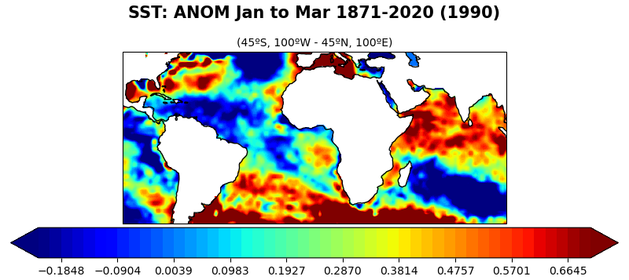

# Spy4Cast


Python framework for working with .nc files and applying methodologies to them as well as plotting


## Installation

To get the latest version:
```console
    $ conda create -n <your-env-name>
    $ conda activate <your-env-name>
    (<your-env-name>) $ conda install pip
    (<your-env-name>) $ pip install git+https://github.com/pabloduran016/Spy4Cast
    (<your-env-name>) $ conda install cartopy
```

To get the latest stable version:
```console
    $ pip install spy4cast
```

## Example

```python
from spy4cast import AnomerMap, Slise, Month, F

DATASETS_DIR = "/datasets/"
HadISST_sst = "HadISST_sst.nc"

sl = Slise(
    lat0=-45, latf=45,
    lon0=-100, lonf=100,
    month0=Month.JAN, monthf=Month.MAR,
    year0=1871, yearf=2020,
    sy=1990,
)
AnomerMap(dataset_dir=DATASETS_DIR, dataset_name=HadISST_sst) \ 
    .open_dataset() \
    .slice_dataset(sl) \
    .apply() \
    .run(F.SHOW_PLOT | F.SAVE_FIG, slise=sl)
```
**Output:**    
  


## Important Notes:

· If you see anywhere in the docs or in the files `slise` and think it is a typo, it is not. Python has a 
built-in function called `slice` and in this library we have decided to use `slise` to avoid unexpected 
behaviours. I hope it is not too ugly...

## Documentation
The documentation for this project is in [https://www.spy4cast-docs.netlify.app]
        

## Plotters
Plotters are in charge of reading the data and plotting it. There are all basses of the Abstract class Plotter:

    class spy4cast.plotters.Plotter(ReadData, ABC)
        This class is also concatenable (see spy4cast.read_data.ReadData)

        @abstractmethod
        def create_plot(flags=0, **kwargs)

        def run(flags=0, **kwargs)
            Creates plots, saves figures, saves data and saves figures if the flags indicate so
            
            · flags: Int Flags (see spy4cast.stypes.F)
        
There are two kinds of Plotters that implemenyt the abstract method `create_plot`

    class spy4cast.plotters.PlotterTS(Plotter):
        This class is concatenable (see spy4cast.read_data.ReadData)

        def create_plot(flgas=0, color=None) 
            Plots a timeseries.
                
            · flags: Int Flags (see spy4cast.stypes.F)
            · color: Color (see spy4cast.stypes.Color) to plot the line (values from 0 to 1).
              Default is (.43, .92, .20) (greenish)    
            
            Raises spy4cast.errors.PlotCreationError if the data is not unidimensional

    class spy4cast.plotters.PlotterMap(Plotter):
        This class is concatenable (see spy4cast.read_data.ReadData)

        def create_plot(flgas=0, slise=None) 
            Plots a map.
                
            · flags: Int Flags (see spy4cast.stypes.F)
            · slise (required spy4cast.stypes.Slise): Must have `sy` filled with the year you want to plot 
              if the data has more than 2 dimensions.
            · cmap: Color map passed into matplotlib.Axes.contourf    
            
            Raises spy4cast.errors.SelectedyearError if the selected year is not valid and 
              spy4cast.errors.PlotDataError if the data's shape is too small


Other kinds of plotters do more than just plot the data. They can apply a methodology. This what are called
Prokers and all inherit from the abstract class `Proker`

    class spy4cast.plottes.Proker(ABC)
        This is the base class of all prokers
        
        @asbtractmethod
        def apply(**kwargs)
        
    class spy4cast.plottes.ClimerTS(PlotterTS)
        This class is in charge of applying the clim methodology on a timeseries

    class spy4cast.plottes.AnomerTS(PlotterTS)
        This class is in charge of applying the anom methodology on a timeseries
        
        The apply method can accept `st` indicating wether or not to perform standarization of the anomaly

    class spy4cast.plottes.ClimerMap(PlotterTS)
        This class is in charge of applying the clim methodology on a map

    class spy4cast.plottes.AnomerMap(PlotterTS)
        This class is in charge of applying the anom methodology on a map
        
        The apply method can accept `st` indicating wether or not to perform standarization of the anomaly


## References
- [xarray](https://www.xarray.pydata.org/en/stable/)
- [numpy](https://www.numpy.org/)
- [cartopy](https://www.scitools.org.uk/cartopy/docs/latest/)
- [matplotlib](https://www.matplotlib.org/stable/api/text_api.html#matplotlib.text.Text)
- [dask](https://www.dask.org/)
- [sphinx](https://www.sphinx-doc.org/)
