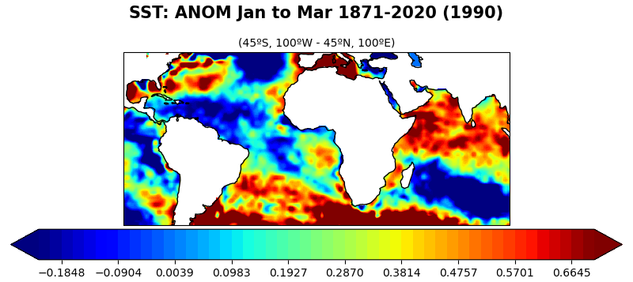

# Spy4Cast

Python framework for working with .nc files and applying methodologies to them as well as plotting


## Setting up
Install dependicies by running the following
```console
pip install -r requirements.txt
```
**Example:**  
```python
import readers as spy
from custom_types import Month, Slise
from readers import F

sl = Slise(
    latitude_min=-45,
    latitude_max=45,
    longitude_min=-100,
    longitude_max=100,
    initial_month=Month.JAN,
    final_month=Month.MAR,
    initial_year=1871,
    final_year=2020,
    selected_year=1990,
)
spy.AnomerMap(dataset_name="HadISST_sst.nc") \
    .load_dataset() \
    .slice_dataset(sl) \
    .apply() \
    .run(F.SHOW_PLOT | F.SAVE_FIG, slise=sl)
```
**Output:**    
  


## ReadData
TBD

## Meteo

## Plotters and Prokers
TBD
### AnomerTS
TBD
### ClimerTS
TBD
### AnomerMap
TBD
### ClimerMap
TBD

## Spy4Caster
TBD

## References
- [xarray](https://xarray.pydata.org/en/stable/)
- [numpy](https://numpy.org/)
- [cartopy](https://scitools.org.uk/cartopy/docs/latest/)
- [matplotlib](https://matplotlib.org/stable/api/text_api.html#matplotlib.text.Text)
