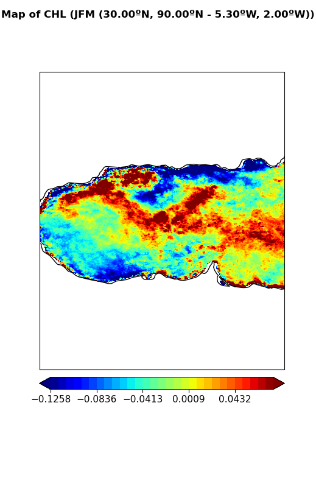
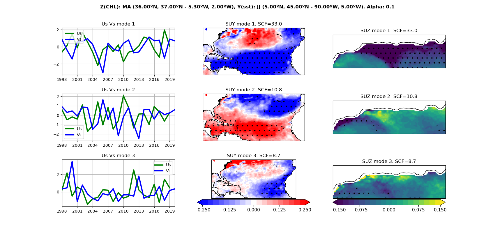
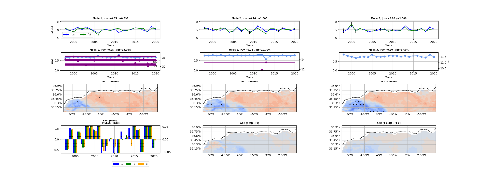

# Spy4Cast


Python framework for working with .nc files and applying methodologies to them as well as plotting


## Installation
**WARNING**: The environment must be compatible with all the dependencies and Cartopy probably needs it to be 3.9 or lower
**NOTE**: Cartopy has to be installed with conda because pip version does not work

To get the latest version:
```console
    $ conda create -n <your-env-name>
    $ conda activate <your-env-name>
    (<your-env-name>) $ conda install pip
    (<your-env-name>) $ conda install cartopy
    (<your-env-name>) $ pip install git+https://github.com/pabloduran016/Spy4Cast
    (<your-env-name>) $ conda install cartopy
```

## Example to plot anomaly map

```python
from spy4cast.meteo import Anom
from spy4cast import Month, Region, set_silence, Dataset

# Define constants ---------------------------------------------------------------------------------- #
DATASET_DIR = '/Users/Shared/datasets/'
PLOTS_DIR = 'plots'
PLOT_DATA_DIR = 'data-anom'

chl_1km_monthly_Sep1997_Dec2020 = 'chl_1km_monthly_Sep1997_Dec2020.nc'
CHL = 'CHL'

chl_region = Region(30, 90, -5.3, -2, Month.MAR, Month.APR, 1998, 2020)

ds = Dataset(chl_1km_monthly_Sep1997_Dec2020, DATASET_DIR).open(CHL).slice(chl_region)

map_anom = Anom(ds, 'map')

map_anom.save('map_anomaly', PLOT_DATA_DIR)
# map_anom = Anom.load('map_anomaly', PLOT_DATA_DIR, type='map')
map_anom.plot(show_plot=True, save_fig=True, year=1999, name='anom-map-example.png', cmap='jet')

ts_anom = Anom(ds, 'ts')
ts_anom.save('ts_anomaly', PLOT_DATA_DIR)
# ts_anom = Anom.load('ts_anomaly', PLOT_DATA_DIR, type='ts')
ts_anom.plot(show_plot=True, save_fig=True, name='anom-ts-example.png')
```

**Output:**



## Example to perform MCA and Crossvalidation

```python
from spy4cast import Dataset, Region, Month
from spy4cast.spy4cast import Preprocess, MCA, Crossvalidation


DATASETS_FOLDER = 'datasets'

predictor = Dataset("oisst_v2_mean_monthly.nc", DATASETS_FOLDER).open(sst)
oisst_region = Region(
    lat0=5, latf=45, lon0=-90, lonf=-5,
    month0=Month.JUN, monthf=Month.JUL,
    year0=1997, yearf=2019,
)  # PREDICTOR: Y
predictor.slice(oisst_region, skip=3)

predictand = Dataset("chl_1km_monthly_Sep1997_Dec2020.nc", DATASETS_FOLDER).open("CHL")
chl_region = Region(
    lat0=36, latf=37, lon0=-5.3, lonf=-2,
    month0=Month.MAR, monthf=Month.APR,
    year0=1998, yearf=2020,
)  # PRECITAND: Z
predictand.slice(chl_region, skip=3)

PLOTS_FOLDER = 'plots-03122022'

predictor_preprocessed = Preprocess(predictor)
predictand_preprocessed = Preprocess(predictand)
nm = 3
alpha = .1
mca = MCA(predictor_preprocessed, predictand_preprocessed, nm, alpha)
mca.plot(save_fig=True, cmap='viridis', name="mca.png", folder=PLOTS_FOLDER, ruy_ticks=[-0.25, -0.125, 0, 0.125, 0.25],
         ruz_ticks=[-0.15, -0.075, 0, 0.075, 0.15])
cross = Crossvalidation(predictor_preprocessed, predictand_preprocessed, nm, alpha)
cross.plot(save_fig=True, folder=PLOTS_FOLDER, name="cross.png", version=2, mca=mca)
```

**Output**



## Documentation
The documentation for this project is in https://spy4cast-docs.netlify.app

## References
- [xarray](https://www.xarray.pydata.org/en/stable/)
- [numpy](https://www.numpy.org/)
- [cartopy](https://www.scitools.org.uk/cartopy/docs/latest/)
- [matplotlib](https://www.matplotlib.org/stable/api/text_api.html#matplotlib.text.Text)
- [dask](https://www.dask.org/)
- [scipy](https://www.scipy.org/)
- [sphinx](https://www.sphinx-doc.org/)
