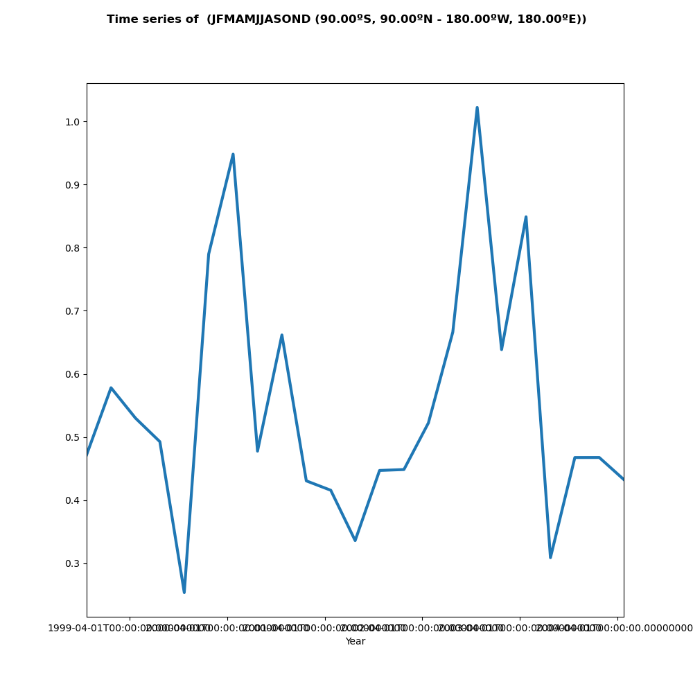

Usage Example
=============

Spy4Cast: Preprocess, MCA and Crossvalidation
+++++++++++++++++++++++++++++++++++++++++++++

Here is an example of how you can use Spy4Cast API to **RUN** the full Spy4Cast methodology and use the included plotting functions.

**Click** :download:`here <../../examples/example_of_crossvalidation.py>` **to download**

.. literalinclude:: ../../examples/example_of_crossvalidation.py

Here is an example of how you can use Spy4Cast API to **PLOT** the previously ran Spy4Cast methodology.

**Click** :download:`here <../../examples/example_of_plotting_precalculated_crossvalidation_and_mca.py>` **to download**

.. literalinclude:: ../../examples/example_of_plotting_precalculated_crossvalidation_and_mca.py

Here is an example of how you can use Spy4Cast API to **RUN** the Spy4Cast methodology and plot it using **CUSTOM PLOTTING FUNCTIONS**.

**Click** :download:`here <../../examples/example_of_crossvalidation_with_custom_plotting.py>` **to download**

.. literalinclude:: ../../examples/example_of_crossvalidation_with_custom_plotting.py

Climatology
+++++++++++

Here is an example of how you can use Spy4Cast API to plot the climatology of a given .nc dataset

.. literalinclude:: ../../examples/example_of_ploting_climatology_maps_and_time_series.py

**Output:**

.. image:: _static/images/clim-map-example.png
    :alt: Output for clim map
    :height: 25em
    :align: center

Anomaly
+++++++

Here is an example of how you can use Spy4Cast API to plot the anomaly of a given .nc dataset

.. literalinclude:: ../../examples/example_of_ploting_anomaly_maps_and_time_series.py

**Output:**

.. image:: _static/images/anom-map-example.png
    :alt: Output for anom map
    :height: 25em
    :align: center

.. image:: _static/images/anom-ts-example.png
    :alt: Output for anom ts
    :height: 25em
    :align: center

