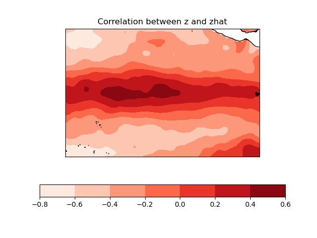

.. Spy4Cast documentation master file

.. |ICON| image:: _static/favicon.png
    :height: 1em
    :alt: Icon

Welcome to Spy4Cast's documentation! |ICON|
===========================================

**Spy4Cast** is a framework for working with .nc files and applying methodologies to them as well as plotting.

.. note::
   If you see anywhere in the docs or in the files `slise` and think it is a typo, it is not. Python has a built-in function called `slice` and in this library we have decided to use `slise` to avoid unexpected behaviours. I hope it is not too ugly...

.. note::
   This project is under active developement

Run the methodology
===================

.. code:: python

    from spy4cast import Dataset, Slise, Month
    from spy4cast.spy4cast import Preprocess, MCA, Crossvalidation

.. code:: python

    ds_y = Dataset("sea_surface_temperature.nc", dir="datasets").open('sst')
    ds_y.slice(Slise(-20, 20, -150, -90, Month.AUG, Month.NOV, 1971, 2003))

    ds_z = Dataset("atmospheric_preasure.nc", dir="datasets").open('pr')
    ds_z.slice(Slise(11.5, 16.5, -25, -15, Month.FEB, Month.MAY, 1972, 2004))

.. code:: python

    y = Preprocess(ds_y)
    z = Preprocess(ds_z)
    y.save('y_', dir='saved_data')
    z.save('z_', dir='saved_data')

.. code:: python

    mca = MCA(y, z, 3, 0.1)
    mca.save('mca_', dir='saved_data')

Analyse results
===============

.. code:: python

    from spy4cast.spy4cast import Preprocess, MCA, Crossvalidation
    import matplotlib.pyplot as plt
    import numpy as np
    import cartopy.crs as ccrs

.. code:: python

    y = Preprocess.load('y_', dir='saved_data')
    z = Preprocess.load('z_', dir='saved_data')

.. code:: python

    mca = MCA.load('mca_', dir='saved_data', dsy=y, dsz=z)

.. code:: python

    fig = plt.figure()
    ax = fig.add_subplot(1, 1, 1, projection=ccrs.PlateCarree())
    nlat, nlon = len(y.lat), len(y.lon)
    ruy = mca.RUY[:, -1].reshape((nlat, nlon))
    im = ax.contourf(y.lon, y.lat, ruy, cmap='Reds')
    fig.colorbar(im, ax=ax, orientation='horizontal')
    ax.coastlines()
    ax.set_title('Correlation between z and zhat')
    fig.show()

.. toctree::
   :maxdepth: 2
   
   usage
   tutorial
   methodologies
   API Reference <toctrees/api-reference>
