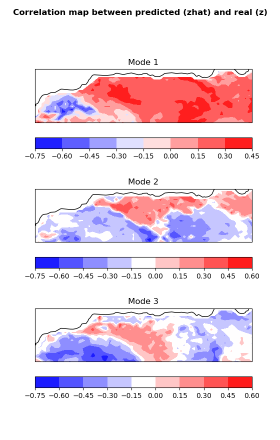

.. _plotting:

Plotting
========

To plot the results you have two main ways to do it:

Fast plots
----------

These fast plots are meant for debugging and to see the results right away.
They are not heavily tested and can break sometimes. We recommend using your
own plotting functions instead of them.

Evry methodology owns a `.plot()` function that takes in several arguments
(check out the :ref:`tutorial<tutorial>`) to make a fast plot.

Own plots
---------

Every user is encouraged to use their own plotting functions with this 3 steps:

.. note::

    Check out the :ref:`tutorial<tutorial>` to learn how to save and load data.

.. code:: python

    # import the necessary libraries
    from spy4cast.spy4cast import Preprocess, Crossvalidation

    import matplotlib.pyplot as plt
    import numpy as np
    import cartopy.crs as ccrs

.. code:: python

    # Load the previously saved results
    y = Preprocess.load('y_', dir='saved_data')
    z = Preprocess.load('z_', dir='saved_data')
    cross = Crossvalidation.load('mca_', dir='saved_data', dsy=y, dsz=z)

.. code:: python

    # Create figure of the correlation maps between z and zhat for the different modes

    fig = plt.figure(figsize=(15, 8))

    nm = cross.r_z_zhat_s_separated_modes.shape[0]
    nzlat = z.lat.shape[0]
    nzlon = z.lon.shape[0]
    for i in range(nm):
        r_z_zhat = cross.r_z_zhat_s_separated_modes[i, :].reshape((nzlat, nzlon))
        ax = fig.add_subplot(3, 1, i+1, projection=ccrs.PlateCarree())
        im = ax.contourf(z.lon, z.lat, r_z_zhat, cmap='bwr')
        ax.coastlines()
        ax.set_title(f'Mode {i+1}')
        fig.colorbar(im, ax=ax, orientation='horizontal')
    fig.suptitle('Correlation map between predicted (zhat) and real (z)', fontweight='bold')
    plt.show()

