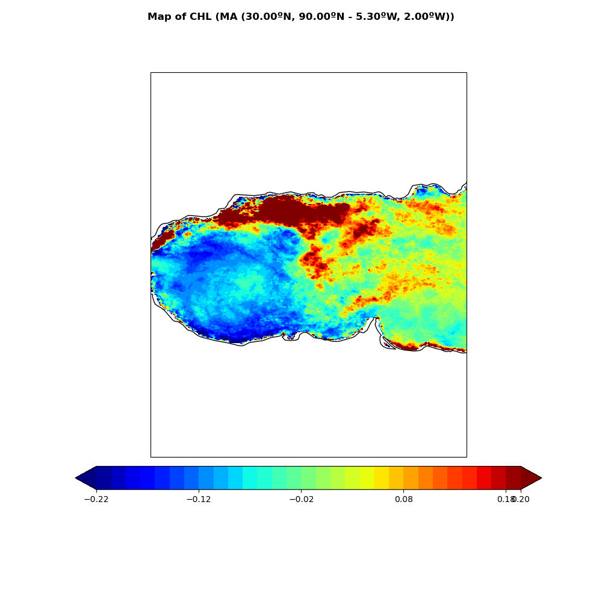
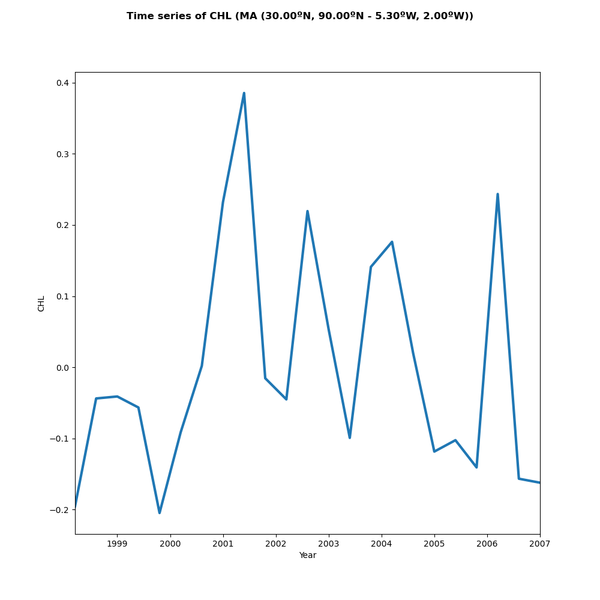

Usage
=====

Installation
------------

To use Spy4Cast, first install it using git:

To get the latest version:

.. warning::

   The environment must be compatible with all the dependencies and Cartopy probably needs it to be 3.9 or lower

.. code-block:: console

    $ conda create -n <your-env-name> python=3.9
    $ conda activate <your-env-name>
    (<your-env-name>) $ conda install pip
    (<your-env-name>) $ conda install cartopy
    (<your-env-name>) $ pip install git+https://github.com/pabloduran016/Spy4Cast
    (<your-env-name>) $ conda install cartopy

.. note::

    Cartopy has to be installed with conda because pip version does not work

..
    To get the latest stable version:

    .. code-block:: console

       $ pip install spy4cast

Example
-------

Climatology
+++++++++++

Here is an example of how you can use Spy4Cast API to plot the climatology of a given .nc dataset

.. literalinclude:: ../../examples/clim-example.py

**Output:**

.. image:: _static/clim-map-example.png
    :alt: Output for clim map
    :height: 25em
    :align: center

.. image:: _static/clim-ts-example.png
    :alt: Output for clim ts
    :height: 25em
    :align: center

Anomaly
+++++++

Here is an example of how you can use Spy4Cast API to plot the anomaly of a given .nc dataset

.. literalinclude:: ../../examples/anom-example.py

**Output:**

Spy4Cast: Preprocess, MCA and Crossvalidation
+++++++++++++++++++++++++++++++++++++++++++++

Here is an example of how you can use Spy4Cast API to do the full Spy4Cast methodology.

**Click** :download:`here <../../examples/spy4cast-example.py>` **to download**

.. literalinclude:: ../../examples/spy4cast-example.py

